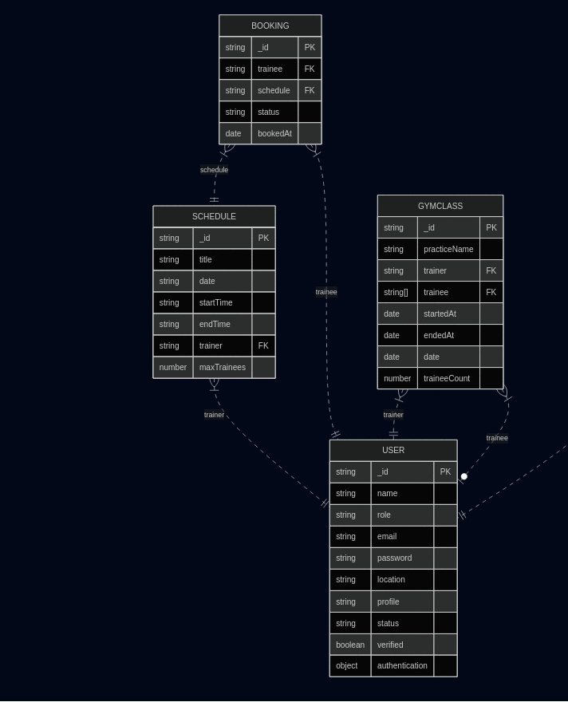

# Project Title: Gym Management System
## Live Demo

You can access the live version of the project here: [Live Link](https://gym-management-ecru.vercel.app/)

## Admin Credentials

For testing purposes, you can use the following admin credentials:

- **Admin Email:** superadmin@gmail.com
- **Admin Password:** superadmin

## Entity-Relationship (ER) Diagram

Here is the ER diagram of the project to help visualize the database structure.



## Installation and Setup

1. Clone the repository:
    ```bash
    git clone https://github.com/Nasir1290/gym-client.git
    ```
3. Install dependencies:
    ```bash
    yarn add
    ```

5. Start the application:
    ```bash
    yarn dev
    ```

## Tech Stack

- **Frontend:** React, Next.js
- **Backend:** Node.js, Express
- **Database:** MongoDB
- **ORM:** Mongoose
- **Validation:** Zod

## Contributing

If you'd like to contribute, please fork the repository and use a feature branch. Pull requests are warmly welcome.

## Contact

For any inquiries, feel free to contact:


---

Made with ❤️ by [Nasir Mollah](https://nasirmollah.vercel.app)
